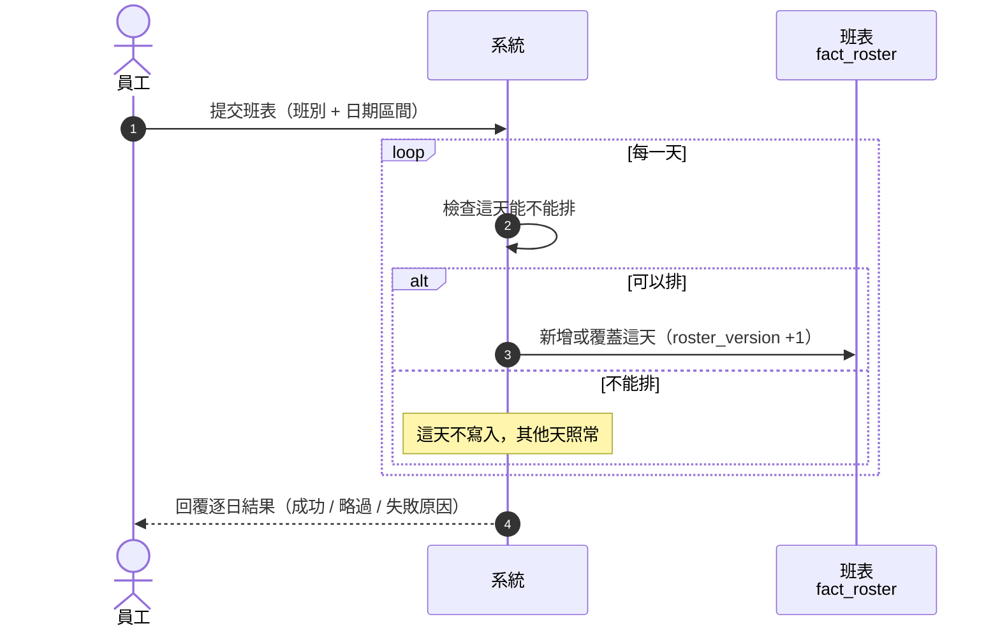
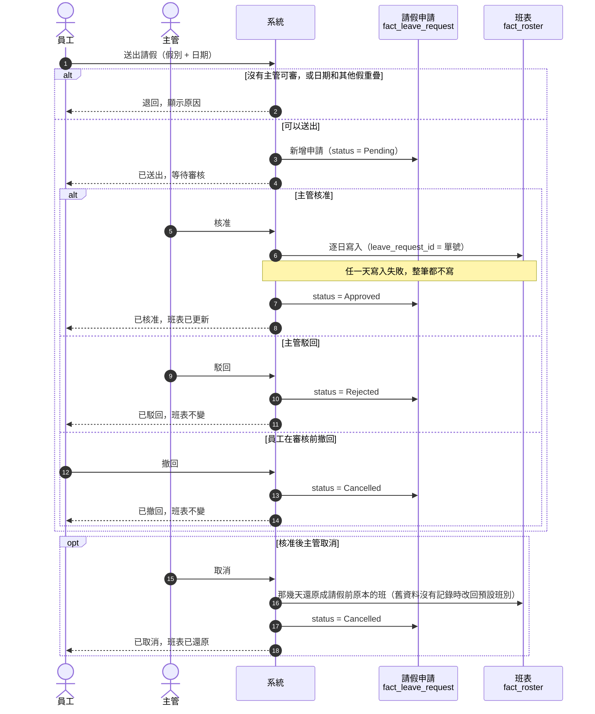
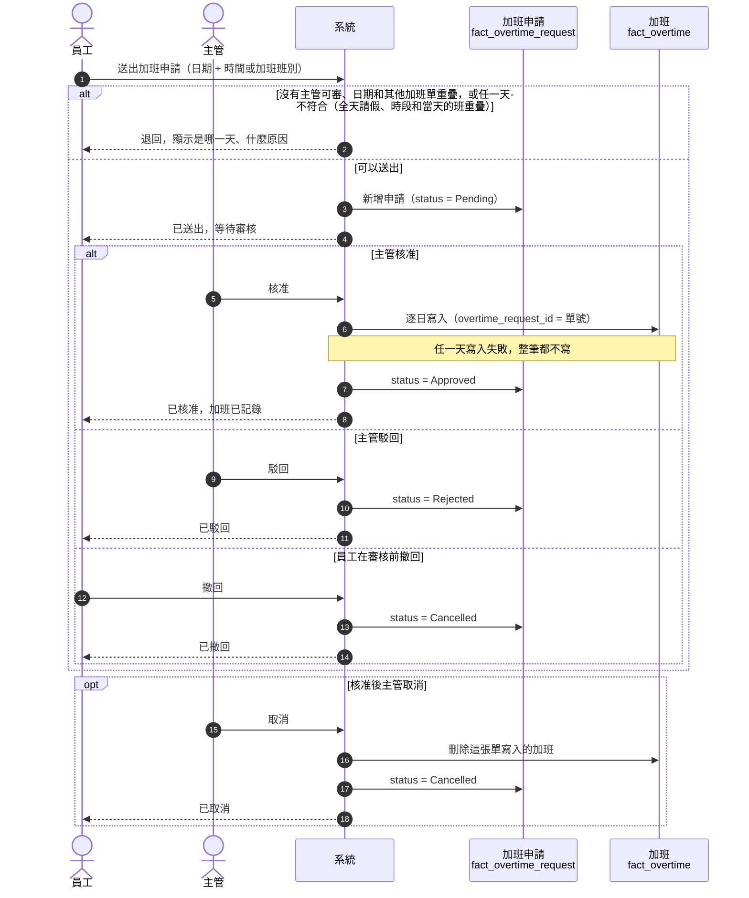
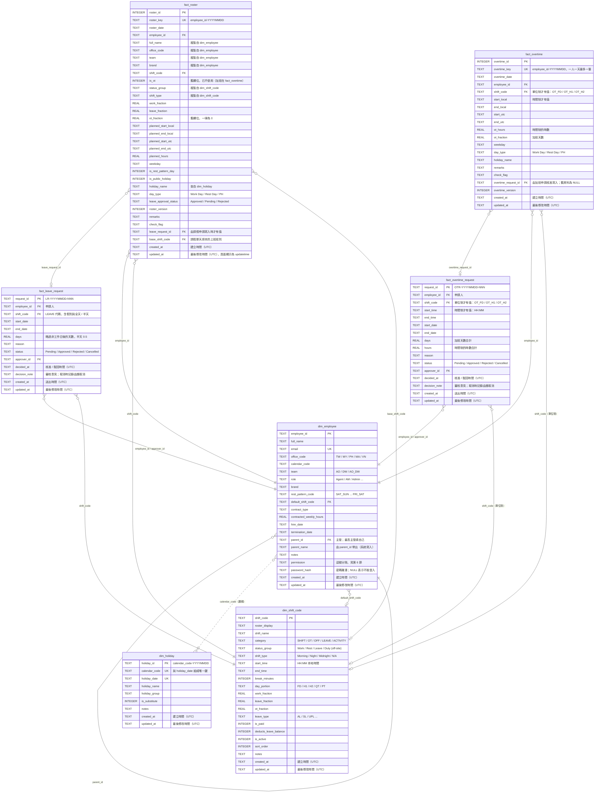
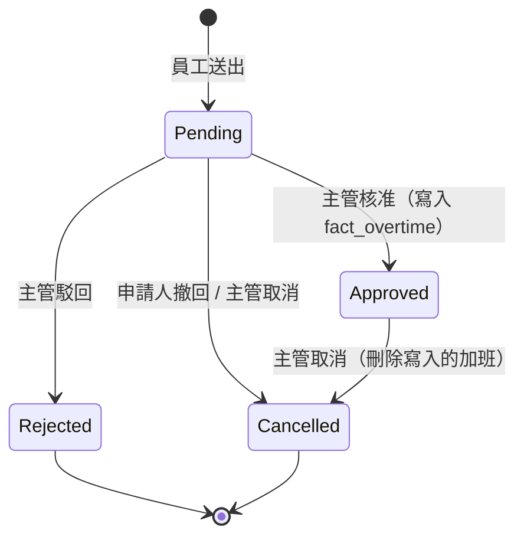
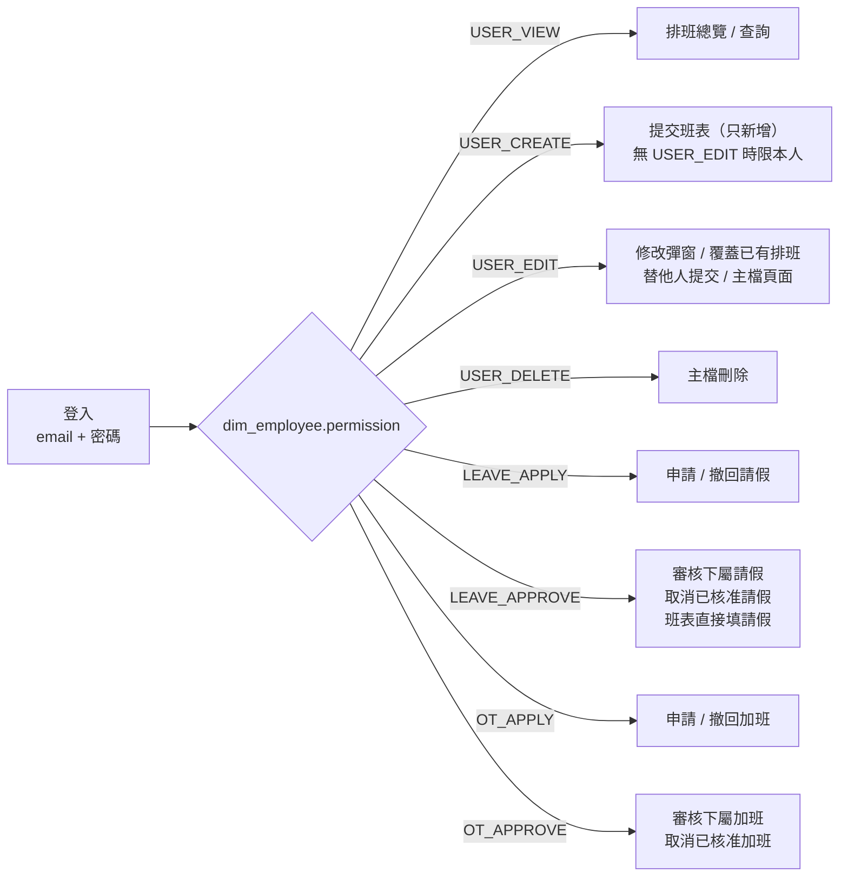

# 排班系統設計說明（roster）

> 最後更新：2026-10-09 (PeterChang)

本文件說明排班系統的業務流程、資料庫結構（`roster.db`）、權限與維運方式。資料表定義見 [db.py](db.py) 的 `SCHEMA`，各業務的 API 見 [routes/](routes/)，可調整的選項與權限見 [config.py](config.py)，文中的代碼與英文狀態見[第 12 節名詞表](#12-名詞表)。

**目錄**

1. [業務流程](#1-業務流程)：提交班表、請假、加班
2. [資料表關聯](#2-資料表關聯)：ER 圖、外鍵與關聯欄位
3. [主管關係](#3-主管關係dim_employeeparent_id)
4. [請假與加班申請流程](#4-請假與加班申請流程)
5. [排班總覽的資料來源](#5-排班總覽的資料來源)
6. [登入與權限](#6-登入與權限)
7. [時間戳記](#7-時間戳記)
8. [舊資料庫的自動升級](#8-舊資料庫的自動升級)
9. [備份](#9-備份)
10. [日誌](#10-日誌)
11. [備註](#11-備註)
12. [名詞表](#12-名詞表)

| 資料表 | 類型 | 內容 |
|---|---|---|
| `dim_shift_code` | 維度 | 班別、假別、休息、加班、公務活動代碼 |
| `dim_employee` | 維度 | 員工、登入帳號、權限、主管關係 |
| `dim_holiday` | 維度 | 各辦公室的國定假日 |
| `fact_roster` | 事實 | 排班結果，一人一天一筆（包含已核准的請假） |
| `fact_leave_request` | 事實 | 請假申請單與審核紀錄 |
| `fact_overtime_request` | 事實 | 加班申請單與審核紀錄 |
| `fact_overtime` | 事實 | 已核准的加班，一人一天最多一筆；與班表分開存，不會覆蓋當天的班 |

| 程式檔案 | 內容 |
|---|---|
| [main.py](main.py) | 啟動網站、每日備份與日誌清理排程、指令列（`set-password`、`backup`） |
| [config.py](config.py) | 可調整的設定：排班規則、代碼選項、權限、備份與日誌 |
| [db.py](db.py) | 資料表定義、初始資料、升級舊資料庫，以及所有資料讀寫與業務規則 |
| [logger.py](logger.py) | JSON 日誌，依日期 / 使用者 / 面向寫檔（見第 10 節） |
| [templates/](templates/) | 頁面模板（Jinja，base.html 為共用版面） |
| [static/](static/) | CSS 與各頁 JS（CSP 禁止 inline script / style） |
| [forms.py](forms.py) | 表單 / JSON 輸入解析與表單預設值 |
| [views.py](views.py) | 畫面與匯出用的資料轉換、模板 filter |
| [routes/](routes/) | 依業務拆分的網址與 API：`auth`（登入、身分驗證）、`roster`（排班總覽、提交班表）、`leave`（請假）、`overtime`（加班）、`dim`（主檔）；共用的權限檢查、日誌與 CSV 下載在 `common` |

## 1. 業務流程

班表有兩個來源：**員工提交班表**、**請假經主管核准**。加班也要經主管核准，核准後另外記在 `fact_overtime`，不會覆蓋當天的班。下面用循序圖表示：實線箭頭是請求，虛線箭頭是回覆；`alt` 框是判斷分支，`loop` 框是逐日重複。括號內是寫入的資料表與欄位。

### 提交班表



「能不能排」的檢查：

- 在職期間內，班別沒停用
- 休息日、國定假日不排上班或請假（加班請另外登記）
- 加班班別（`OT_*`）不能在這裡提交，要到加班頁申請
- 已有加班的日子不能排全天請假
- 請假單寫入的日子不能改，要先取消請假
- 已經有班的日子，要有修改權限才能覆蓋

### 請假



- 半天 / 部分假（`H1` / `H2` / `QT`）只能請已經排班的日子，請假時段依當天的班計算，例如 09:00–18:00 的班請 `H1` 是 09:00–13:00
- 請假時會記下原本的班（`base_shift_code`），取消後還原成原本的班

完整規則見第 4 節。

### 加班



- **時間制**（上班日提早上班 / 延後下班，例如 18:00–21:00）：一次只申請一天；時間每 `TIME_STEP_MINUTES`（30）分鐘一格，至少 `OT_MIN_HOURS`（1）小時、最多 `OT_MAX_HOURS`（12）小時。選單只列出不和前一天、當天、隔天的班重疊的時段。天數 = 時數 ÷ `OT_FULL_DAY_HOURS`（8），最多 1 天
- **單位制**（沒有上班的日子整天 / 半天，例如休息日）：選 `OT_FD` / `OT_H1` / `OT_H2`，天數 = 1 / 0.5 / 0.5，可以一次申請多天；當天有排上班時不能用
- 申請送出後不能修改，要撤回後重新申請；已核准的加班日不能請全天假

完整規則見第 4 節。

## 2. 資料表關聯



### 外鍵與關聯欄位

| 參照方欄位 | 被參照方 | 類型 | 說明 |
|---|---|---|---|
| `fact_roster.employee_id` | `dim_employee.employee_id` | 外鍵 | 每筆排班屬於一位員工 |
| `fact_roster.shift_code` | `dim_shift_code.shift_code` | 外鍵 | 每筆排班對應一個班別或假別 |
| `fact_roster.leave_request_id` | `fact_leave_request.request_id` | 外鍵（可空） | 由請假申請核准寫入的那幾天才有值；手動輸入的請假為 NULL |
| `fact_roster.base_shift_code` | `dim_shift_code.shift_code` | 外鍵（可空） | 請假那天原本排的上班班別：半天假依它計算請假時段，取消請假時還原成它；不是請假或當天原本沒排班時為 NULL |
| `fact_leave_request.employee_id` | `dim_employee.employee_id` | 外鍵 | 申請人 |
| `fact_leave_request.approver_id` | `dim_employee.employee_id` | 外鍵（可空） | 審核人；待審核時為 NULL |
| `fact_leave_request.shift_code` | `dim_shift_code.shift_code` | 外鍵 | 只能是 `category = 'LEAVE'` 的代碼（程式檢查） |
| `fact_overtime.overtime_request_id` | `fact_overtime_request.request_id` | 外鍵（可空） | 由加班申請核准寫入的日子才有值；舊資料為 NULL |
| `fact_overtime.employee_id` | `dim_employee.employee_id` | 外鍵 | 每筆加班屬於一位員工 |
| `fact_overtime.shift_code` | `dim_shift_code.shift_code` | 外鍵（可空） | 單位制才有值，只能是 `category = 'OT'` 的代碼（程式檢查）；時間制為 NULL |
| `fact_overtime_request.employee_id` | `dim_employee.employee_id` | 外鍵 | 申請人 |
| `fact_overtime_request.approver_id` | `dim_employee.employee_id` | 外鍵（可空） | 審核人；待審核時為 NULL |
| `fact_overtime_request.shift_code` | `dim_shift_code.shift_code` | 外鍵（可空） | 單位制才有值；時間制為 NULL |
| `dim_employee.default_shift_code` | `dim_shift_code.shift_code` | 外鍵（可空） | 預設班別；取消請假時，若沒有記錄原本的班（舊資料）就還原成它 |
| `dim_employee.parent_id` | `dim_employee.employee_id` | 外鍵（自我參照） | 主管。最高主管指向自己 |
| `dim_employee.calendar_code` | `dim_holiday.calendar_code` | 邏輯關聯 | 決定員工適用哪一套假日 |
| `fact_roster`（寫入時） | `dim_holiday` | 邏輯關聯 | 依 `calendar_code` + `roster_date` 查出 `holiday_name`、`day_type = 'PH'` |

## 3. 主管關係（`dim_employee.parent_id`）

每位員工都必須有主管，由「員工」頁面的主管下拉選單指定，`parent_name` 由系統依 `parent_id` 帶出。

| 規則 | 說明 |
|---|---|
| 必填 | 存檔時檢查（資料表沒有 `NOT NULL`，因為舊資料可能是空的） |
| 主管資格 | 非 Agent、在職、有 `LEAVE_APPROVE` 權限；下拉選單只列在職的非 Agent |
| 最高主管 | `parent_id` 填自己；只有符合主管資格的人可以這樣填 |
| 不可循環 | 從新主管往上找，不能繞回自己（例如 A → B → A） |
| 仍有下屬時 | 不能改成 Agent、設為離職或拿掉 `LEAVE_APPROVE`，要先把下屬改到其他主管；也不能刪除（外鍵限制） |
| 改名 | 主管的 `full_name` 修改後，下屬的 `parent_name` 同步更新 |

## 4. 請假與加班申請流程

請假和加班走同一套審批規則：由申請人的主管（`parent_id`）審核，最高主管的申請由其他有審核權限的人審，不能審自己的申請。

### 請假

申請和班表分開：`fact_leave_request` 記錄申請與審核過程，班表（`fact_roster`）只放已核准的請假。


| 步驟 | 規則 |
|---|---|
| 送出 | 申請人必須已有主管，而且目前要有人能審（主管能登入且有 `LEAVE_APPROVE`；最高主管則需要另一位這樣的人），否則不能送出。只能選 `LEAVE` 代碼；非全天假（H1 / H2 / QT）只能請單日，而且當天必須已排有上下班時間的上班班別；一次最多 `MAX_RANGE_DAYS` 天。依員工的休息模式與假日行事曆略過非工作日；區間內沒有工作日就不能送出 |
| 重疊檢查 | 不能和自己其他待審核 / 已核准的申請重疊，也不能落在班表上已經是請假的日子 |
| 審核人 | 申請人的 `parent_id`。最高主管（`parent_id` 是自己）或舊資料沒有主管時，其他有 `LEAVE_APPROVE` 的人都能審。不能審核自己的申請 |
| 核准 | 重新計算日期並逐日寫入 `fact_roster`（`leave_approval_status = 'Approved'`、`leave_request_id`、`remarks` = 單號與原因），原本的排班檢查照常執行。任一天失敗就整筆回滾 |
| 同時審核 | 狀態更新只在狀態仍是原狀態時生效，兩人同時審同一張時，後送出的會收到「狀態已被其他人變更」 |
| 請假時段 | 寫入班表時記下原本的班（`base_shift_code`）。非全天假依原本的班的工時（扣掉休息時間）切出請假時段：`H1` 請在前面、`H2` / `QT` 請在後面，休息時間留在兩段之間。例如 09:00–18:00、休息 1 小時：`H1` 請 09:00–13:00、上班 14:00–18:00；`QT` 請 16:00–18:00。班表的上下班時間（`planned_*`）記剩下要上班的時段 |
| 取消已核准 | 只還原 `leave_request_id` 仍指向這張單的日子：改回請假前原本的班（`base_shift_code`）；舊資料沒有記錄時改回預設班別，都沒有就刪除那天 |
| 保護 | 由請假單寫入的日子不能從「提交班表」或修改彈窗直接改，要先到請假頁取消 |

請假頁面（`/leave`）：

- **請假月曆**（所有能進請假頁的人）：以月為單位，每格顯示當天已核准的請假人數與待審核人數，人數越多顏色越深（1、2、3、4 人以上四個層級）。點日期看名單（姓名、team、假別、已核准 / 待審核，不顯示原因）。資料來自 `fact_roster`（`status_group = 'Leave'`，包含手動輸入的請假）加上待審核申請展開的日子；用 `?cal=YYYY-MM` 切換月份。
- **待審核**（`LEAVE_APPROVE`）：只列主管是自己的員工（以及最高主管）的申請，自己的申請不會出現。顯示同 team 同期間已核准 / 待審核的請假人數，可填意見後核准或駁回。導覽列的「請假」旁顯示待審數量，排班總覽頁頂端也會提醒並連到請假頁。
- **我的請假**（`LEAVE_APPLY`）：選假別與日期時呼叫 `GET /api/leave/preview` 即時顯示天數與日期；下方列出自己的申請，待審核的顯示「待 誰 審核」並可以撤回。
- **審核紀錄**（`LEAVE_APPROVE`）：自己可審範圍內已處理的申請，已核准的可以取消。

### 加班

申請和加班紀錄分開：`fact_overtime_request` 記錄申請與審核過程，`fact_overtime` 只放已核准的加班。單號格式 `OTR-YYYYMMDD-NNN`，對應請假的 `LR-YYYYMMDD-NNN`。



| 步驟 | 規則 |
|---|---|
| 送出 | 申請人必須已有主管，而且目前要有人能審（主管能登入且有 `OT_APPROVE`；最高主管則需要另一位這樣的人）。時間制與單位制擇一。時間制一次一天，時間以 30 分鐘為單位、1 到 12 小時，不能和前一天 / 當天 / 隔天的班重疊（請假的日子看原本的班）；單位制只能用在沒有上班的日子，一次最多 `MAX_RANGE_DAYS` 天。**每一天都要符合**：在職、不是全天請假、這天還沒有加班；任一天不符合就不能送出，訊息會帶出是哪一天 |
| 重疊檢查 | 不能和自己其他待審核 / 已核准的加班申請重疊（一人一天最多一筆加班） |
| 審核人 | 同請假，但看的是 `OT_APPROVE` |
| 核准 | 重新檢查一次，逐日寫入 `fact_overtime`（`overtime_request_id` = 單號、`remarks` = 原因）。任一天失敗就整筆回滾 |
| 同時審核 | 同請假：後送出的會收到「狀態已被其他人變更」 |
| 取消已核准 | 刪除 `overtime_request_id` 指向這張單的加班 |
| 修改 | 送出後不能修改，撤回後重新申請 |
| 舊資料 | 審批上線前的加班沒有申請單，視為已核准（申請單欄顯示「舊資料」）；本人有 `USER_EDIT` 時可以在排班總覽的「加班紀錄」刪除 |

加班頁面（`/overtime`）：

- **時間選單**：選日期後呼叫 `GET /api/overtime/slots?date=` 取得可選的開始 / 結束時間（伺服器依當天的班計算），選單只列這些時段，並顯示當天的班。送出與核准時伺服器用同一套規則再檢查。

- **待審核**（`OT_APPROVE`）：只列主管是自己的員工（以及最高主管）的申請，可填意見後核准或駁回。導覽列的「加班」旁顯示待審數量，排班總覽頁頂端也會提醒。
- **我的加班**（`OT_APPLY`）：選方式、日期與時間時呼叫 `GET /api/overtime/preview` 即時顯示天數、時數與日期；下方列出自己的申請，待審核的可以撤回。API 送出為 `POST /api/overtime`。
- **審核紀錄**（`OT_APPROVE`）：自己可審範圍內已處理的申請，已核准的可以取消。

## 5. 排班總覽的資料來源

排班與已核准的請假存在 `fact_roster`（一人一天一筆）；已核准的加班從 `fact_overtime` 疊加，在班別後標示「+OT」（只有加班沒有班的日子顯示 OT）；待審核的加班從 `fact_overtime_request` 展開，標示「+OT（待審）」並以虛線框顯示；待審核的請假另從 `fact_leave_request` 疊加。首頁總覽可選年份與月份（全年或單月），依下列規則分類：

| 總覽狀態 | 判斷方式 | 小計欄位 |
|---|---|---|
| 加班（OT） | `fact_overtime` 有這天的紀錄 | `SUM(fact_overtime.ot_fraction)`，另顯示 `SUM(ot_hours)` 時數 |
| 請假（LEAVE） | 班別 `category = 'LEAVE'` | `SUM(leave_fraction)` |
| 上班（SHIFT） | 班別 `category = 'SHIFT'` | `SUM(work_fraction)` |
| 休息 / 國定假日（OFF） | 班別 `category = 'OFF'` | — |
| 公務活動（ACTIVITY） | 班別 `category = 'ACTIVITY'` | `SUM(work_fraction)` |
| 加班（待審核）（OT_PENDING） | `fact_overtime_request.status = 'Pending'`，展開成實際會加班的日子 | 不計入 |
| 請假（待審核）（PENDING） | `fact_leave_request.status = 'Pending'`，展開成實際會請的日子，以虛線框疊在原本的班別上 | 不計入 |

半天假（例如 `AL_H1`）同時計入 0.5 天請假與 0.5 天上班；逐日明細的時間欄顯示「請假 09:00 → 13:00（上班 14:00 → 18:00）」。

### 小計的逐日明細

點總覽某人的「上班 / 請假 / 加班」數字，會跳出該員工在目前年份或月份的逐日明細；點欄位標題則列出所有人（多一欄姓名）。資料由 `GET /api/roster/detail?kind=work|leave|ot&year=&month=&employee_id=` 提供（需 `USER_VIEW`）。

| 項目 | 列出的日子 | 欄位 |
|---|---|---|
| 上班 | `work_fraction > 0` | 日期、星期、日別（含假日名稱）、班別、上班時間、工時、天數、備註 / 檢查 |
| 請假 | `leave_fraction > 0`，再加上待審核申請的日子（天數記 0，標示「待審，不計入」） | 同上，另加核准狀態、申請單號（沒有申請單的顯示「手動輸入」） |
| 加班 | `fact_overtime` 的每一筆，再加上待審核申請的日子（天數記 0，標示「待審，不計入」） | 同上（時間為加班時段、工時為加班時數），另加方式（時間 / 整天或半天）、申請單號（沒有申請單的顯示「舊資料」） |

彈窗標題的「共 N 天」只加總已計入的天數，所以會等於總覽上的小計。

## 6. 登入與權限

登入帳號為 `dim_employee.email`，密碼以雜湊存在 `password_hash`。沒有密碼或已離職（`termination_date` 早於今天）的員工不能登入。

驗證採用 JWT（HS256），登入有效 30 分鐘（`config.JWT_EXPIRE_MINUTES`），token 本身不存進資料庫：

- 網頁：登入後 token 存在 HttpOnly cookie（`access_token`），到期自動回到登入頁。
- API：`POST /api/login` 取得 token，之後帶 `Authorization: Bearer <token>`。
- token 內含 `sub`（employee_id）、`iat`、`exp`，以及密碼指紋。每次請求都會重新讀取 `dim_employee`，所以修改密碼、設定離職或調整 `permission` 都會立即生效。

`permission` 預設值依 `role` 決定，可在「員工」頁面逐人調整：

| 角色 | 預設權限 |
|---|---|
| Agent | `USER_VIEW`, `USER_CREATE`, `LEAVE_APPLY`, `OT_APPLY` |
| 其他（例如 AM、Admin） | `USER_VIEW`, `USER_CREATE`, `USER_EDIT`, `USER_DELETE`, `LEAVE_APPLY`, `LEAVE_APPROVE`, `OT_APPLY`, `OT_APPROVE` |

各權限對應的功能：

| 功能 | 需要的權限 |
|---|---|
| 排班總覽、查詢 | `USER_VIEW` |
| 排班總覽頁的「提交班表」「查詢與修改」 | 所有人的「成員」下拉都只有登入者本人，只能提交、查詢、修改自己的排班（伺服器端也會檢查） |
| 提交班表（新增） | `USER_CREATE` |
| 修改彈窗；提交時覆蓋已有排班 | `USER_EDIT` |
| `/api/roster` | `USER_CREATE`；沒有 `USER_EDIT` 時只能提交自己的排班，有 `USER_EDIT` 可替其他員工提交 |
| 申請加班、撤回自己待審核的申請、`/api/overtime` | `OT_APPLY`，只能申請自己的 |
| 審核加班、取消已核准的加班 | `OT_APPROVE`，且是申請人的主管（見第 4 節） |
| 刪除舊加班資料（沒有申請單的） | `USER_EDIT`，只能刪除自己的 |
| 匯出排班總覽 | `USER_VIEW` |
| 匯出請假審核紀錄 | `LEAVE_APPROVE` |
| 匯出加班審核紀錄 | `OT_APPROVE` |
| 匯出班別 / 員工 / 假日主檔 | `USER_VIEW` + `USER_EDIT` |
| 在班表直接填請假代碼 | `LEAVE_APPROVE`；其他人的班別下拉不列請假代碼，要走請假申請 |
| 申請請假、撤回自己待審核的申請 | `LEAVE_APPLY` |
| 審核請假、取消已核准的請假 | `LEAVE_APPROVE`，且是申請人的主管（見第 4 節） |
| 班別 / 員工 / 假日主檔（查看、編輯） | `USER_VIEW` + `USER_EDIT` |
| 主檔新增 | 再加上 `USER_CREATE` |
| 主檔刪除 | 再加上 `USER_DELETE` |



### 網頁的瀏覽器保護

每個頁面都會附上安全設定（Content-Security-Policy，內容見 `config.CONTENT_SECURITY_POLICY`），要求瀏覽器：

- 只執行本系統 [static/](static/) 資料夾裡的程式與樣式。就算有人在備註、請假原因等欄位填入惡意程式碼，瀏覽器也不會執行。
- 不允許其他網站把本系統嵌進它們的頁面（防止偽裝成本系統騙使用者點擊）。

開發時要注意：頁面模板（[templates/](templates/)）裡不能直接寫程式或樣式（`<script>…</script>`、`<style>`、`onclick=` 這類寫法會被瀏覽器擋掉），要放到 `static/` 的檔案；頁面需要的伺服器資料用 `data-*` 屬性傳給程式。送出前的確認視窗用 `<form data-confirm="訊息">`，下拉選單選了就送出用 `<select data-autosubmit>`。

### 匯出檔案

各頁的「匯出檔案」按鈕下載 CSV（UTF-8 BOM，Excel 可直接開啟中文）。以 `=`、`+`、`-`、`@` 開頭的文字會在前面加上 `'`，避免 Excel 當成公式執行。

| 按鈕位置 | 路徑 | 匯出範圍 | 檔名 |
|---|---|---|---|
| 排班總覽（年份 / 月份選單右邊） | `GET /export/roster?year=&month=` | 目前選的年份或月份，欄位同畫面（含加班時數）；待審核的請假加註「（待審）」，待審核的加班顯示「+OT（待審）」 | `roster_2026.csv`、`roster_2026-10.csv` |
| 請假頁「審核紀錄」 | `GET /leave/history/export` | 與畫面相同範圍（自己可審的已處理申請），不限筆數 | `leave_history_YYYYMMDD.csv` |
| 加班頁「審核紀錄」 | `GET /overtime/history/export` | 同上 | `overtime_history_YYYYMMDD.csv` |
| 班別 / 員工 / 假日主檔（「新增」右邊） | `GET /dim/<kind>/export` | 整張表的所有欄位，不含 `password_hash` | `dim_shift_code_YYYYMMDD.csv` 等 |

## 7. 時間戳記

所有資料表都有 `created_at`（建立時間）與 `updated_at`（最後修改時間），格式為 UTC ISO 8601，例如 `2026-10-08T03:12:00+00:00`。由系統寫入，頁面上唯讀。

| 表 | 寫入時機 |
|---|---|
| `fact_roster` | 提交時新增：兩者皆寫入。再次提交、修改彈窗、請假核准或取消時覆蓋：更新 `updated_at`，`roster_version` +1 |
| `fact_overtime` | 加班申請核准時新增：兩者皆寫入 |
| `fact_overtime_request` | 同 `fact_leave_request` |
| `fact_leave_request` | 送出時兩者皆寫入；核准、駁回、取消時更新 `updated_at`（核准 / 駁回另寫 `decided_at`） |
| `dim_shift_code` / `dim_holiday` | 主檔頁面新增：兩者皆寫入。編輯：只更新 `updated_at` |
| `dim_employee` | 同上；另外設定或重設密碼（頁面或 `set-password` 指令）也會更新 `updated_at` |

## 8. 舊資料庫的自動升級

啟動時 `init_db` 會補齊舊的 `roster.db`，不需手動遷移：

- 補上缺少的欄位：`permission`、`password_hash`、各維度表的 `created_at` / `updated_at`、`fact_roster.leave_request_id`、`fact_roster.base_shift_code`（舊資料為空，取消時改回預設班別）、`dim_employee.parent_name`。
- `dim_employee.manager_id` 改名為 `parent_id`，並依 `parent_id` 回填 `parent_name`。
- 舊班表上的加班（`is_ot = 1` 或 `OT_*` 班別）搬到 `fact_overtime`，並刪除班表那天（原本的班別已被加班覆蓋、無法還原）。搬移前會另存 `backups/before_overtime_migration_YYYYMMDD_HHMMSS.db`（不會被每日備份清掉），受影響的人與日期寫在 `_system` 日誌，需由本人重新提交原本的班。
- 第一次建立 `fact_leave_request` 時，既有帳號補上請假權限：Agent 補 `LEAVE_APPLY`，其他角色補 `LEAVE_APPLY`、`LEAVE_APPROVE`。
- 第一次建立 `fact_overtime_request` 時，既有帳號補上加班權限：Agent 補 `OT_APPLY`，其他角色補 `OT_APPLY`、`OT_APPROVE`；`fact_overtime` 補上 `overtime_request_id` 欄位，既有加班視為已核准的舊資料。
- 時間戳記是空的資料，以第一次執行 `init_db` 的時間回填。

升級後 `parent_id` 仍是空的員工不能送出請假申請；到「員工」頁面補上主管即可。

## 9. 備份

為了不讓資料只存在一個檔案裡，伺服器會自動備份 `roster.db`：

- **時機**：啟動時一次，之後每天 `BACKUP_HOUR`（預設凌晨 3 點，伺服器當地時間）一次；也可以手動執行 `py -3.12 main.py backup`。
- **方式**：用 SQLite 官方的 backup API 複製，網站寫入中也不會產生壞檔。
- **位置與檔名**：`backups/roster_YYYYMMDD_HHMMSS.db`（`ROSTER_BACKUP_DIR` 可改位置）。
- **保留**：同一天只留最新一份，最多保留最近 `BACKUP_KEEP_DAYS`（預設 14）天，舊的自動刪除，所以備份資料夾不會無限增加。備份資料夾裡其他檔案不會被動到。
- **升級前快照**：會刪改既有資料的升級（例如加班搬到 `fact_overtime`）會先另存 `backups/before_<用途>_YYYYMMDD_HHMMSS.db`。檔名不符合每日備份的格式，所以不會被自動清理；確認升級沒問題後可以手動刪除。
- **關閉**：環境變數 `ROSTER_BACKUP=false`。
- **還原**：停止伺服器，把要用的備份檔複製回專案資料夾並改名為 `roster.db`，再啟動。

開發時 debug 模式每次自動重新載入都會備份一次；因為同一天只留最新一份，不會擠掉前幾天的備份。

## 10. 日誌

系統把「使用者做了什麼」和「系統怎麼執行」分開記錄，依日期與使用者分資料夾：

```
logs/
└── 2026-10-09/
    ├── amy@example.com/
    │   ├── behavior.log   使用者行為（關鍵動作）
    │   └── debug.log      系統執行（每個請求、警告、錯誤與 traceback）
    ├── _anonymous/        未登入的請求、登入失敗
    └── _system/           啟動、備份、清理、資料升級
```

- **格式**：每一行是一筆 JSON，固定欄位有 `timestamp`、`level`、`service`（`roster`）、`stage`（環境變數 `ROSTER_STAGE`，預設 `local`）、`status`（`ok` / `warning` / `error`）、`message`、`user`；在請求中產生的紀錄另有 `method`、`path`、`ip`。
- **同時輸出**：也會印到終端機，方便開發時直接看。
- **位置**：`logs/`（環境變數 `ROSTER_LOG_DIR` 可改）。資料夾以員工 email 命名（轉小寫），內容含操作紀錄，所以不進版控。
- **保留**：最近 `LOG_KEEP_DAYS`（預設 30）天，與每日備份同時清理；關閉備份時仍會清理。只刪除 `YYYY-MM-DD` 格式的資料夾。

`behavior.log` 記錄的動作（`action` 欄位）：

| 業務 | action |
|---|---|
| 登入 | `login`、`logout`；登入失敗 `login_failed` 記在 `_anonymous`，附上嘗試的帳號 |
| 排班 | `roster_submit`、`roster_edit`，附上班別、日期與新增 / 更新 / 略過 / 失敗天數 |
| 請假 | `leave_apply`、`leave_approve`、`leave_reject`、`leave_cancel` |
| 加班 | `overtime_apply`、`overtime_approve`、`overtime_reject`、`overtime_cancel`；刪除舊資料 `overtime_delete` |
| 主檔 | `dim_create`、`dim_update`、`dim_delete`，修改時附上改了哪些欄位 |
| 匯出 | `export`，附上匯出的範圍 |

`debug.log` 記錄每個請求的狀態碼與耗時（`duration_ms`）；被業務規則擋下的操作記 WARNING（例如「日期與其他假重疊」）；程式錯誤記 ERROR 並附完整 traceback（`exception` 欄位）。`_system` 另記 `startup`、`backup`、`log_cleanup`、`overtime_migration`。

**個資原則**：一律不記密碼與 token；請假與加班原因只記字數（`reason_length`），不記內容；主檔修改只記欄位名稱，不記值。

**分析範例**（DuckDB）：

```sql
-- 各動作的使用次數
SELECT action, COUNT(*) AS n
FROM read_json_auto('logs/*/*/behavior.log')
GROUP BY action ORDER BY n DESC;

-- 最慢的頁面
SELECT path, ROUND(AVG(duration_ms), 1) AS avg_ms, COUNT(*) AS n
FROM read_json_auto('logs/*/*/debug.log')
WHERE message = 'request'
GROUP BY path ORDER BY avg_ms DESC LIMIT 10;
```

## 11. 備註

- `fact_roster` 會複製員工與班別的部分欄位（姓名、辦公室、班別時間、工時等）。之後修改維度表，已寫入的排班不會自動更新，要重新提交那幾天才會套用。
- `base_shift_code` 上線前核准的請假沒有記錄原本的班：取消時仍還原為**目前的**預設班別，半天假也看不到請假時段。
- 外鍵限制只在連線執行 `PRAGMA foreign_keys = ON` 時生效（`RosterDB` 已預設開啟）。所以刪除仍被參照的員工（有排班、有請假申請或仍是別人的主管）或班別會失敗。
- CHECK 限制只在建立資料表時生效；修改 `config.py` 的選項後，既有 `roster.db` 的限制不會自動改變。
- 索引：`ix_roster_emp_date` 建在 `fact_roster (employee_id, roster_date)`；`ix_leave_emp_date` 建在 `fact_leave_request (employee_id, start_date, end_date)`；`ix_leave_status` 建在 `fact_leave_request (status)`；`ix_overtime_emp_date` 建在 `fact_overtime (employee_id, overtime_date)`；`ix_ot_request_emp_date` 建在 `fact_overtime_request (employee_id, start_date, end_date)`；`ix_ot_request_status` 建在 `fact_overtime_request (status)`。

## 12. 名詞表

| 名詞 | 意思 |
|---|---|
| 維度表（`dim_`）/ 事實表（`fact_`） | 維度表是較少變動的主檔（員工、班別、假日）；事實表是每天累積的紀錄（排班、請假申請） |
| `FD` / `H1` / `H2` / `QT` / `PT` | 全天 / 上半天 / 下半天 / 四分之一天 / 短班（例如 4 小時）；請假時 `H1` 從上班開始算，`H2` / `QT` 從下班往前算 |
| `base_shift_code` | 請假那天原本排的上班班別，用來計算半天假的時段與取消請假時還原 |
| `category` | 班別類別：`SHIFT` 上班、`OT` 加班、`OFF` 休息或國定假日、`LEAVE` 請假、`ACTIVITY` 公務活動 |
| `status_group` | 狀態分組：`Work` 上班、`Rest` 休息、`Leave` 請假、`Duty (off-site)` 外出公務 |
| `day_type` | 日別：`Work Day` 工作日、`Rest Day` 休息日（依員工的休息模式）、`PH` 國定假日 |
| 請假 / 加班申請 `status` | `Pending` 待審核、`Approved` 已核准、`Rejected` 已駁回、`Cancelled` 已取消（含撤回） |
| `LR-` / `OTR-` | 申請單號前綴：Leave Request 請假申請、Overtime Request 加班申請 |
| `*_APPLY` / `*_APPROVE` | 權限：`LEAVE_` 為請假、`OT_` 為加班；`APPLY` 可申請與撤回自己的，`APPROVE` 可審核下屬與取消已核准的 |
| 假別代碼 | `AL` 特休、`SL` 病假、`UPL` 無薪假、`EL` 緊急假、`CL` 喪假、`RL` 補休、`HL` 住院假、`ML` 產假、`PL` 陪產假、`ESL` 考試 / 進修假、`NS` 未到班 |
| `parent_id` | 員工的主管（最高主管填自己） |
| `work_fraction` / `leave_fraction` / `ot_fraction` | 這天算幾天的上班 / 請假 / 加班，例如半天假是 0.5 請假 + 0.5 上班；時間制加班是時數 ÷ 8，例如 3 小時 = 0.375 天 |
| 時間制 / 單位制加班 | 時間制選開始與結束時間（上班日提早上班 / 延後下班，30 分鐘一格、至少 1 小時、一次一天）；單位制選 `OT_FD` / `OT_H1` / `OT_H2`（沒有上班的日子整天或半天） |
| UTC | 世界協調時間；`created_at`、`updated_at` 等時間戳記一律存 UTC |
