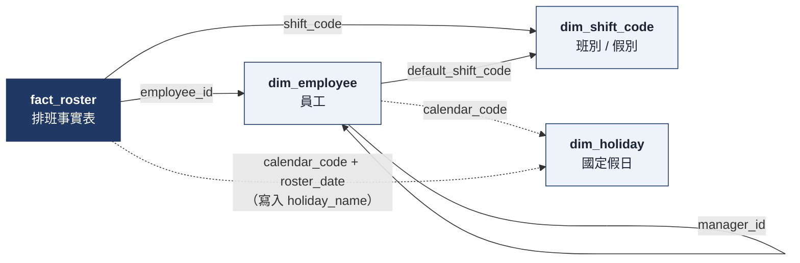
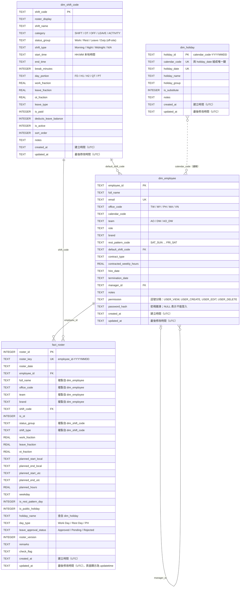
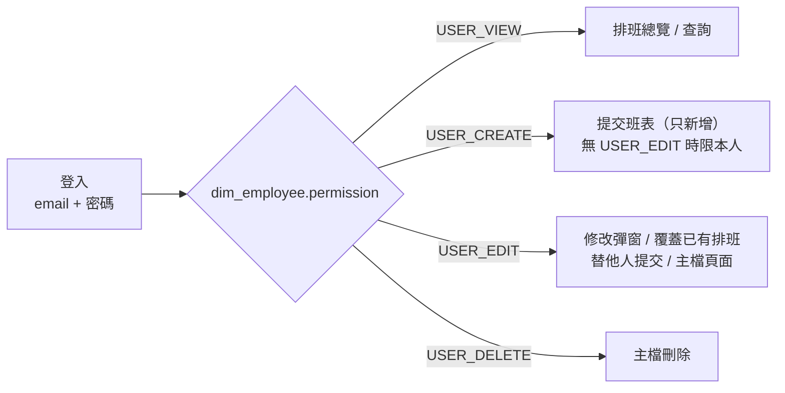

# 資料庫結構（roster.db）

資料表定義見 [crud.py](crud.py) 的 `SCHEMA`。

## 1. 資料表關聯有向圖

箭頭方向為「參照方 → 被參照方」。實線是資料庫中的外鍵（FOREIGN KEY）；虛線是程式邏輯上的關聯，資料庫沒有外鍵限制。

`dim_employee.manager_id → dim_employee` 是自我參照，形成圖中唯一的循環。

| 參照方欄位 | 被參照方 | 類型 | 說明 |
|---|---|---|---|
| `fact_roster.employee_id` | `dim_employee.employee_id` | 外鍵 | 每筆排班屬於一位員工 |
| `fact_roster.shift_code` | `dim_shift_code.shift_code` | 外鍵 | 每筆排班對應一個班別或假別 |
| `dim_employee.default_shift_code` | `dim_shift_code.shift_code` | 外鍵（可空） | 員工預設班別 |
| `dim_employee.manager_id` | `dim_employee.employee_id` | 外鍵（可空，自我參照） | 主管，形成循環 |
| `dim_employee.calendar_code` | `dim_holiday.calendar_code` | 邏輯關聯 | 決定員工適用哪一套假日 |
| `fact_roster`（寫入時） | `dim_holiday` | 邏輯關聯 | 依 `calendar_code` + `roster_date` 查出 `holiday_name`、`day_type = 'PH'` |

## 2. ER 圖（含欄位）

## 3. Vantage Roster Situation 總覽的資料來源

排班、請假、加班都存在同一張 `fact_roster`（一人一天一筆），首頁總覽依下列規則分類：

| 總覽狀態 | 判斷方式 | 年度小計欄位 |
|---|---|---|
| 加班（OT） | `fact_roster.is_ot = 1`，或班別 `category = 'OT'` | `SUM(ot_fraction)` |
| 請假（LEAVE） | 班別 `category = 'LEAVE'` | `SUM(leave_fraction)` |
| 上班（SHIFT） | 班別 `category = 'SHIFT'` | `SUM(work_fraction)` |
| 休息 / 國定假日（OFF） | 班別 `category = 'OFF'` | — |
| 公務活動（ACTIVITY） | 班別 `category = 'ACTIVITY'` | `SUM(work_fraction)` |

半天假（例如 `AL_H1`）同時計入 0.5 天請假與 0.5 天上班。

## 4. 登入與權限

登入帳號為 `dim_employee.email`，密碼以雜湊存在 `password_hash`。沒有密碼或已離職（`termination_date` 早於今天）的員工不能登入。

驗證採用 JWT（HS256），登入有效 30 分鐘（`config.JWT_EXPIRE_MINUTES`），token 本身不存進資料庫：

- 網頁：登入後 token 存在 HttpOnly cookie（`access_token`），到期自動回到登入頁。
- API：`POST /api/login` 取得 token，之後帶 `Authorization: Bearer <token>`。
- token 內含 `sub`（employee_id）、`iat`、`exp`，以及密碼指紋。每次請求都會重新讀取 `dim_employee`，所以修改密碼、設定離職或調整 `permission` 都會立即生效。

`permission` 預設值依 `role` 決定，可在「員工」頁面逐人調整：

| 角色 | 預設權限 |
|---|---|
| Agent | `USER_VIEW`, `USER_CREATE` |
| 其他（例如 AM） | `USER_VIEW`, `USER_CREATE`, `USER_EDIT`, `USER_DELETE` |

各權限對應的功能：

| 功能 | 需要的權限 |
|---|---|
| 排班總覽、查詢 | `USER_VIEW` |
| 提交班表、`/api/roster`（新增） | `USER_CREATE`；沒有 `USER_EDIT` 時只能提交自己的排班（員工下拉只有自己） |
| 修改彈窗；提交時覆蓋已有排班；替其他員工提交 | `USER_EDIT` |
| 班別 / 員工 / 假日主檔（查看、編輯） | `USER_VIEW` + `USER_EDIT` |
| 主檔新增 | 再加上 `USER_CREATE` |
| 主檔刪除 | 再加上 `USER_DELETE` |

## 5. 時間戳記

四張表都有 `created_at`（建立時間）與 `updated_at`（最後修改時間），格式為 UTC ISO 8601，例如 `2026-10-08T03:12:00+00:00`。由系統寫入，頁面上唯讀。

| 表 | 寫入時機 |
|---|---|
| `fact_roster` | 提交時新增：兩者皆寫入。再次提交或用修改彈窗修改：更新 `updated_at`，`roster_version` +1 |
| `dim_shift_code` / `dim_holiday` | 主檔頁面新增：兩者皆寫入。編輯：只更新 `updated_at` |
| `dim_employee` | 同上；另外設定或重設密碼（頁面或 `set-password` 指令）也會更新 `updated_at` |

初始資料，以及加入欄位前就已存在的資料，`created_at` / `updated_at` 會以第一次執行 `init_db` 的時間回填。

## 6. 備註

- `fact_roster` 會複製員工與班別的部分欄位（姓名、辦公室、班別時間、工時等）。之後修改維度表，已寫入的排班不會自動更新，要重新提交那幾天才會套用。
- 外鍵限制只在連線執行 `PRAGMA foreign_keys = ON` 時生效（`RosterDB` 已預設開啟）。所以刪除仍被參照的員工或班別會失敗。
- 舊的 `roster.db` 在啟動時會自動補上缺少的欄位（`permission`、`password_hash`、各維度表的 `created_at` / `updated_at`），不需手動遷移。
- 索引：`ix_roster_emp_date` 建在 `fact_roster (employee_id, roster_date)`。
