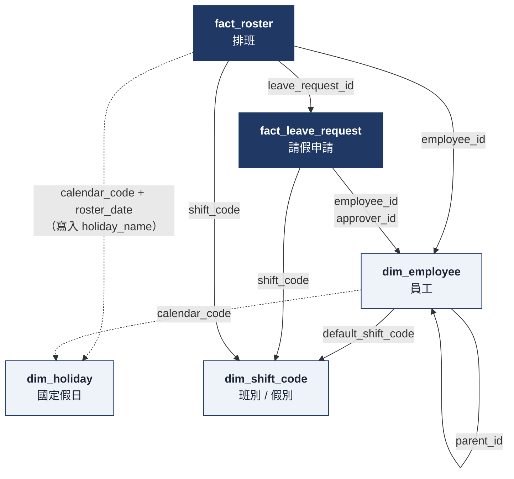
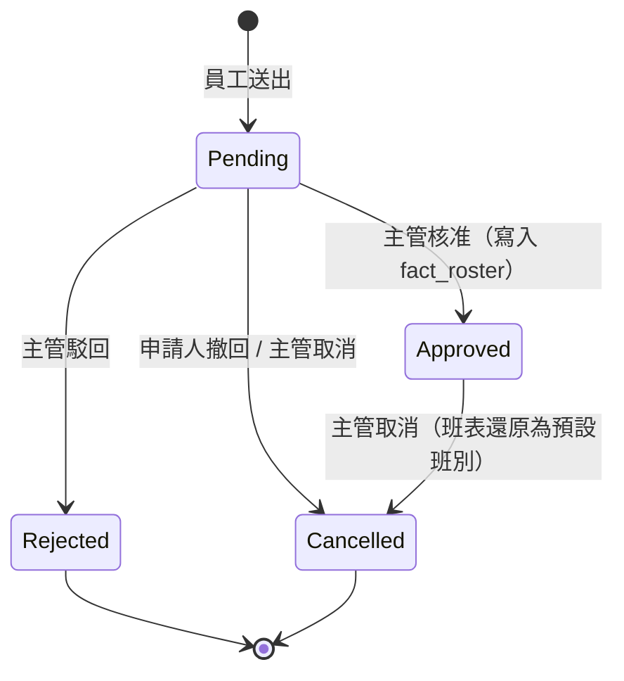
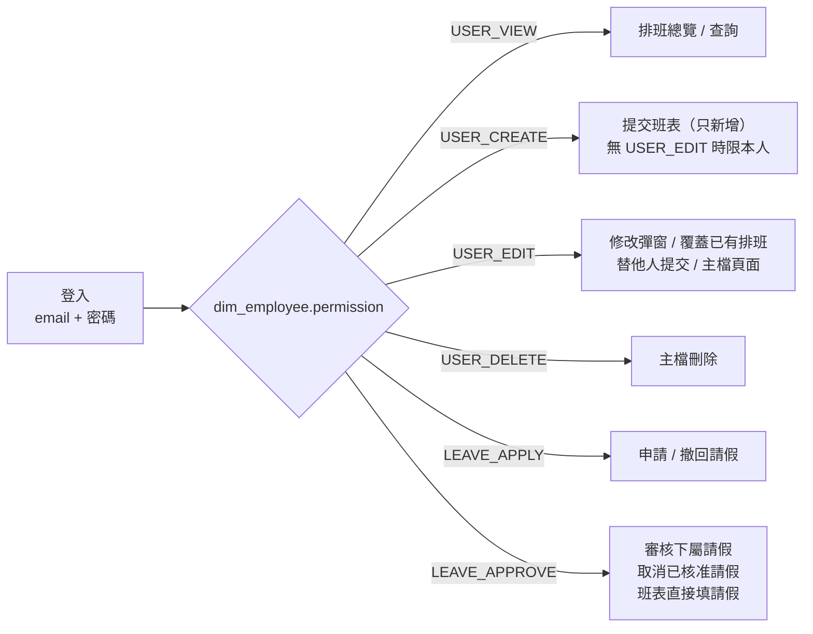

# 資料庫結構（roster.db）

資料表定義見 [api.py](api.py) 的 `SCHEMA`，可調整的選項與權限見 [config.py](config.py)。

| 資料表 | 類型 | 內容 |
|---|---|---|
| `dim_shift_code` | 維度 | 班別、假別、休息、加班、公務活動代碼 |
| `dim_employee` | 維度 | 員工、登入帳號、權限、主管關係 |
| `dim_holiday` | 維度 | 各辦公室的國定假日 |
| `fact_roster` | 事實 | 排班結果，一人一天一筆（包含已核准的請假） |
| `fact_leave_request` | 事實 | 請假申請單與審核紀錄 |

## 1. 資料表關聯

箭頭方向為「參照方 → 被參照方」，由上而下依參照層級排列（事實表在上、維度表在下），線條不交錯。實線是資料庫中的外鍵（FOREIGN KEY）；虛線是程式邏輯上的關聯，資料庫沒有外鍵限制。`fact_leave_request` 到 `dim_employee` 的申請人與審核人兩個外鍵合併成一條線。

| 參照方欄位 | 被參照方 | 類型 | 說明 |
|---|---|---|---|
| `fact_roster.employee_id` | `dim_employee.employee_id` | 外鍵 | 每筆排班屬於一位員工 |
| `fact_roster.shift_code` | `dim_shift_code.shift_code` | 外鍵 | 每筆排班對應一個班別或假別 |
| `fact_roster.leave_request_id` | `fact_leave_request.request_id` | 外鍵（可空） | 由請假申請核准寫入的那幾天才有值；手動輸入的請假為 NULL |
| `fact_leave_request.employee_id` | `dim_employee.employee_id` | 外鍵 | 申請人 |
| `fact_leave_request.approver_id` | `dim_employee.employee_id` | 外鍵（可空） | 審核人；待審核時為 NULL |
| `fact_leave_request.shift_code` | `dim_shift_code.shift_code` | 外鍵 | 只能是 `category = 'LEAVE'` 的代碼（程式檢查） |
| `dim_employee.default_shift_code` | `dim_shift_code.shift_code` | 外鍵（可空） | 預設班別；取消已核准的請假時用來還原班表 |
| `dim_employee.parent_id` | `dim_employee.employee_id` | 外鍵（自我參照） | 主管。最高主管指向自己 |
| `dim_employee.calendar_code` | `dim_holiday.calendar_code` | 邏輯關聯 | 決定員工適用哪一套假日 |
| `fact_roster`（寫入時） | `dim_holiday` | 邏輯關聯 | 依 `calendar_code` + `roster_date` 查出 `holiday_name`、`day_type = 'PH'` |

## 2. ER 圖（含欄位）

```mermaid
erDiagram
    fact_roster }o--o| fact_leave_request : "leave_request_id"
    fact_roster }o--|| dim_employee : "employee_id"
    fact_leave_request }o--|| dim_employee : "employee_id / approver_id"
    dim_employee }o--|| dim_employee : "parent_id"
    dim_employee }o..o{ dim_holiday : "calendar_code（邏輯）"
    dim_employee }o--o| dim_shift_code : "default_shift_code"
    fact_leave_request }o--|| dim_shift_code : "shift_code"
    fact_roster }o--|| dim_shift_code : "shift_code"

    dim_shift_code {
        TEXT shift_code PK
        TEXT roster_display
        TEXT shift_name
        TEXT category "SHIFT / OT / OFF / LEAVE / ACTIVITY"
        TEXT status_group "Work / Rest / Leave / Duty (off-site)"
        TEXT shift_type "Morning / Night / Midnight / N/A"
        TEXT start_time "HH:MM 本地時間"
        TEXT end_time
        INTEGER break_minutes
        TEXT day_portion "FD / H1 / H2 / QT / PT"
        REAL work_fraction
        REAL leave_fraction
        REAL ot_fraction
        TEXT leave_type "AL / SL / UPL ..."
        INTEGER is_paid
        INTEGER deducts_leave_balance
        INTEGER is_active
        INTEGER sort_order
        TEXT notes
        TEXT created_at "建立時間（UTC）"
        TEXT updated_at "最後修改時間（UTC）"
    }

    dim_employee {
        TEXT employee_id PK
        TEXT full_name
        TEXT email UK
        TEXT office_code "TW / MY / PH / MA / VN"
        TEXT calendar_code
        TEXT team "AO / DW / AO_DW"
        TEXT role "Agent / AM / Admin ..."
        TEXT brand
        TEXT rest_pattern_code "SAT_SUN ... FRI_SAT"
        TEXT default_shift_code FK
        TEXT contract_type
        REAL contracted_weekly_hours
        TEXT hire_date
        TEXT termination_date
        TEXT parent_id FK "主管；最高主管填自己"
        TEXT parent_name "由 parent_id 帶出（系統寫入）"
        TEXT notes
        TEXT permission "逗號分隔，見第 5 節"
        TEXT password_hash "密碼雜湊；NULL 表示不能登入"
        TEXT created_at "建立時間（UTC）"
        TEXT updated_at "最後修改時間（UTC）"
    }

    dim_holiday {
        TEXT holiday_id PK "calendar_code-YYYYMMDD"
        TEXT calendar_code UK "與 holiday_date 組成唯一鍵"
        TEXT holiday_date UK
        TEXT holiday_name
        TEXT holiday_group
        INTEGER is_substitute
        TEXT notes
        TEXT created_at "建立時間（UTC）"
        TEXT updated_at "最後修改時間（UTC）"
    }

    fact_roster {
        INTEGER roster_id PK
        TEXT roster_key UK "employee_id-YYYYMMDD"
        TEXT roster_date
        TEXT employee_id FK
        TEXT full_name "複製自 dim_employee"
        TEXT office_code "複製自 dim_employee"
        TEXT team "複製自 dim_employee"
        TEXT brand "複製自 dim_employee"
        TEXT shift_code FK
        INTEGER is_ot
        TEXT status_group "複製自 dim_shift_code"
        TEXT shift_type "複製自 dim_shift_code"
        REAL work_fraction
        REAL leave_fraction
        REAL ot_fraction
        TEXT planned_start_local
        TEXT planned_end_local
        TEXT planned_start_utc
        TEXT planned_end_utc
        REAL planned_hours
        TEXT weekday
        INTEGER is_rest_pattern_day
        INTEGER is_public_holiday
        TEXT holiday_name "查自 dim_holiday"
        TEXT day_type "Work Day / Rest Day / PH"
        TEXT leave_approval_status "Approved / Pending / Rejected"
        INTEGER roster_version
        TEXT remarks
        TEXT check_flag
        TEXT leave_request_id FK "由請假申請寫入時才有值"
        TEXT created_at "建立時間（UTC）"
        TEXT updated_at "最後修改時間（UTC），頁面顯示為 updatetime"
    }

    fact_leave_request {
        TEXT request_id PK "LR-YYYYMMDD-NNN"
        TEXT employee_id FK "申請人"
        TEXT shift_code FK "LEAVE 代碼，含假別與全天 / 半天"
        TEXT start_date
        TEXT end_date
        REAL days "略過非工作日後的天數，半天 0.5"
        TEXT reason
        TEXT status "Pending / Approved / Rejected / Cancelled"
        TEXT approver_id FK
        TEXT decided_at "核准 / 駁回時間（UTC）"
        TEXT decision_note "審核意見；取消時記錄由誰取消"
        TEXT created_at "送出時間（UTC）"
        TEXT updated_at "最後修改時間（UTC）"
    }
```

## 3. 主管關係（`dim_employee.parent_id`）

每位員工都必須有主管，由「員工」頁面的主管下拉選單指定，`parent_name` 由系統依 `parent_id` 帶出。

| 規則 | 說明 |
|---|---|
| 必填 | 存檔時檢查（資料表沒有 `NOT NULL`，因為舊資料可能是空的） |
| 主管資格 | 非 Agent、在職、有 `LEAVE_APPROVE` 權限；下拉選單只列在職的非 Agent |
| 最高主管 | `parent_id` 填自己；只有符合主管資格的人可以這樣填 |
| 不可循環 | 從新主管往上找，不能繞回自己（例如 A → B → A） |
| 仍有下屬時 | 不能改成 Agent、設為離職或拿掉 `LEAVE_APPROVE`，要先把下屬改到其他主管；也不能刪除（外鍵限制） |
| 改名 | 主管的 `full_name` 修改後，下屬的 `parent_name` 同步更新 |

## 4. 請假申請流程

申請和班表分開：`fact_leave_request` 記錄申請與審核過程，班表（`fact_roster`）只放已核准的請假。

| 步驟 | 規則 |
|---|---|
| 送出 | 申請人必須已有主管，而且目前要有人能審（主管能登入且有 `LEAVE_APPROVE`；最高主管則需要另一位這樣的人），否則不能送出。只能選 `LEAVE` 代碼；非全天假（H1 / H2 / QT）只能請單日；一次最多 `MAX_RANGE_DAYS` 天。依員工的休息模式與假日行事曆略過非工作日；區間內沒有工作日就不能送出 |
| 重疊檢查 | 不能和自己其他待審核 / 已核准的申請重疊，也不能落在班表上已經是請假的日子 |
| 審核人 | 申請人的 `parent_id`。最高主管（`parent_id` 是自己）或舊資料沒有主管時，其他有 `LEAVE_APPROVE` 的人都能審。不能審核自己的申請 |
| 核准 | 重新計算日期並逐日寫入 `fact_roster`（`leave_approval_status = 'Approved'`、`leave_request_id`、`remarks` = 單號與原因），原本的排班檢查照常執行。任一天失敗就整筆回滾 |
| 同時審核 | 狀態更新只在狀態仍是原狀態時生效，兩人同時審同一張時，後送出的會收到「狀態已被其他人變更」 |
| 取消已核准 | 只還原 `leave_request_id` 仍指向這張單的日子：改回員工的預設班別，沒有預設班別就刪除那天 |
| 保護 | 由請假單寫入的日子不能從「提交班表」或修改彈窗直接改，要先到請假頁取消 |

請假頁面（`/leave`）：

- **請假月曆**（所有能進請假頁的人）：以月為單位，每格顯示當天已核准的請假人數與待審核人數，人數越多顏色越深（1、2、3、4 人以上四個層級）。點日期看名單（姓名、team、假別、已核准 / 待審核，不顯示原因）。資料來自 `fact_roster`（`status_group = 'Leave'`，包含手動輸入的請假）加上待審核申請展開的日子；用 `?cal=YYYY-MM` 切換月份。
- **待審核**（`LEAVE_APPROVE`）：只列主管是自己的員工（以及最高主管）的申請，自己的申請不會出現。顯示同 team 同期間已核准 / 待審核的請假人數，可填意見後核准或駁回。導覽列的「請假」旁顯示待審數量，排班總覽頁頂端也會提醒並連到請假頁。
- **我的請假**（`LEAVE_APPLY`）：選假別與日期時呼叫 `GET /api/leave/preview` 即時顯示天數與日期；下方列出自己的申請，待審核的顯示「待 誰 審核」並可以撤回。
- **審核紀錄**（`LEAVE_APPROVE`）：自己可審範圍內已處理的申請，已核准的可以取消。

## 5. 排班總覽的資料來源

排班、已核准的請假、加班都存在 `fact_roster`（一人一天一筆）；待審核的請假另從 `fact_leave_request` 疊加。首頁總覽可選年份與月份（全年或單月），依下列規則分類：

| 總覽狀態 | 判斷方式 | 小計欄位 |
|---|---|---|
| 加班（OT） | `fact_roster.is_ot = 1`，或班別 `category = 'OT'` | `SUM(ot_fraction)` |
| 請假（LEAVE） | 班別 `category = 'LEAVE'` | `SUM(leave_fraction)` |
| 上班（SHIFT） | 班別 `category = 'SHIFT'` | `SUM(work_fraction)` |
| 休息 / 國定假日（OFF） | 班別 `category = 'OFF'` | — |
| 公務活動（ACTIVITY） | 班別 `category = 'ACTIVITY'` | `SUM(work_fraction)` |
| 請假（待審核）（PENDING） | `fact_leave_request.status = 'Pending'`，展開成實際會請的日子，以虛線框疊在原本的班別上 | 不計入 |

半天假（例如 `AL_H1`）同時計入 0.5 天請假與 0.5 天上班。

### 小計的逐日明細

點總覽某人的「上班 / 請假 / 加班」數字，會跳出該員工在目前年份或月份的逐日明細；點欄位標題則列出所有人（多一欄姓名）。資料由 `GET /api/roster/detail?kind=work|leave|ot&year=&month=&employee_id=` 提供（需 `USER_VIEW`）。

| 項目 | 列出的日子 | 欄位 |
|---|---|---|
| 上班 | `work_fraction > 0` | 日期、星期、日別（含假日名稱）、班別、上班時間、工時、天數、備註 / 檢查 |
| 請假 | `leave_fraction > 0`，再加上待審核申請的日子（天數記 0，標示「待審，不計入」） | 同上，另加核准狀態、申請單號（沒有申請單的顯示「手動輸入」） |
| 加班 | `ot_fraction > 0` | 同上，另加「標記加班」或「OT 班別」 |

彈窗標題的「共 N 天」只加總已計入的天數，所以會等於總覽上的小計。

## 6. 登入與權限

登入帳號為 `dim_employee.email`，密碼以雜湊存在 `password_hash`。沒有密碼或已離職（`termination_date` 早於今天）的員工不能登入。

驗證採用 JWT（HS256），登入有效 30 分鐘（`config.JWT_EXPIRE_MINUTES`），token 本身不存進資料庫：

- 網頁：登入後 token 存在 HttpOnly cookie（`access_token`），到期自動回到登入頁。
- API：`POST /api/login` 取得 token，之後帶 `Authorization: Bearer <token>`。
- token 內含 `sub`（employee_id）、`iat`、`exp`，以及密碼指紋。每次請求都會重新讀取 `dim_employee`，所以修改密碼、設定離職或調整 `permission` 都會立即生效。

`permission` 預設值依 `role` 決定，可在「員工」頁面逐人調整：

| 角色 | 預設權限 |
|---|---|
| Agent | `USER_VIEW`, `USER_CREATE`, `LEAVE_APPLY` |
| 其他（例如 AM、Admin） | `USER_VIEW`, `USER_CREATE`, `USER_EDIT`, `USER_DELETE`, `LEAVE_APPLY`, `LEAVE_APPROVE` |

各權限對應的功能：

| 功能 | 需要的權限 |
|---|---|
| 排班總覽、查詢 | `USER_VIEW` |
| 排班總覽頁的「提交班表」「查詢與修改」 | 所有人的「成員」下拉都只有登入者本人，只能提交、查詢、修改自己的排班（伺服器端也會檢查） |
| 提交班表（新增） | `USER_CREATE` |
| 修改彈窗；提交時覆蓋已有排班 | `USER_EDIT` |
| `/api/roster` | `USER_CREATE`；沒有 `USER_EDIT` 時只能提交自己的排班，有 `USER_EDIT` 可替其他員工提交 |
| 匯出排班總覽 | `USER_VIEW` |
| 匯出審核紀錄 | `LEAVE_APPROVE` |
| 匯出班別 / 員工 / 假日主檔 | `USER_VIEW` + `USER_EDIT` |
| 在班表直接填請假代碼 | `LEAVE_APPROVE`；其他人的班別下拉不列請假代碼，要走請假申請 |
| 申請請假、撤回自己待審核的申請 | `LEAVE_APPLY` |
| 審核請假、取消已核准的請假 | `LEAVE_APPROVE`，且是申請人的主管（見第 4 節） |
| 班別 / 員工 / 假日主檔（查看、編輯） | `USER_VIEW` + `USER_EDIT` |
| 主檔新增 | 再加上 `USER_CREATE` |
| 主檔刪除 | 再加上 `USER_DELETE` |

### 匯出檔案

各頁的「匯出檔案」按鈕下載 CSV（UTF-8 BOM，Excel 可直接開啟中文）。以 `=`、`+`、`-`、`@` 開頭的文字會在前面加上 `'`，避免 Excel 當成公式執行。

| 按鈕位置 | 路徑 | 匯出範圍 | 檔名 |
|---|---|---|---|
| 排班總覽（年份 / 月份選單右邊） | `GET /export/roster?year=&month=` | 目前選的年份或月份，欄位同畫面；待審核的請假加註「（待審）」 | `roster_2026.csv`、`roster_2026-10.csv` |
| 請假頁「審核紀錄」 | `GET /leave/history/export` | 與畫面相同範圍（自己可審的已處理申請），不限筆數 | `leave_history_YYYYMMDD.csv` |
| 班別 / 員工 / 假日主檔（「新增」右邊） | `GET /dim/<kind>/export` | 整張表的所有欄位，不含 `password_hash` | `dim_shift_code_YYYYMMDD.csv` 等 |

## 7. 時間戳記

所有資料表都有 `created_at`（建立時間）與 `updated_at`（最後修改時間），格式為 UTC ISO 8601，例如 `2026-10-08T03:12:00+00:00`。由系統寫入，頁面上唯讀。

| 表 | 寫入時機 |
|---|---|
| `fact_roster` | 提交時新增：兩者皆寫入。再次提交、修改彈窗、請假核准或取消時覆蓋：更新 `updated_at`，`roster_version` +1 |
| `fact_leave_request` | 送出時兩者皆寫入；核准、駁回、取消時更新 `updated_at`（核准 / 駁回另寫 `decided_at`） |
| `dim_shift_code` / `dim_holiday` | 主檔頁面新增：兩者皆寫入。編輯：只更新 `updated_at` |
| `dim_employee` | 同上；另外設定或重設密碼（頁面或 `set-password` 指令）也會更新 `updated_at` |

## 8. 舊資料庫的自動升級

啟動時 `init_db` 會補齊舊的 `roster.db`，不需手動遷移：

- 補上缺少的欄位：`permission`、`password_hash`、各維度表的 `created_at` / `updated_at`、`fact_roster.leave_request_id`、`dim_employee.parent_name`。
- `dim_employee.manager_id` 改名為 `parent_id`，並依 `parent_id` 回填 `parent_name`。
- 第一次建立 `fact_leave_request` 時，既有帳號補上請假權限：Agent 補 `LEAVE_APPLY`，其他角色補 `LEAVE_APPLY`、`LEAVE_APPROVE`。
- 時間戳記是空的資料，以第一次執行 `init_db` 的時間回填。

升級後 `parent_id` 仍是空的員工不能送出請假申請；到「員工」頁面補上主管即可。

## 9. 備份

為了不讓資料只存在一個檔案裡，伺服器會自動備份 `roster.db`：

- **時機**：啟動時一次，之後每天 `BACKUP_HOUR`（預設凌晨 3 點，伺服器當地時間）一次；也可以手動執行 `py -3.12 main.py backup`。
- **方式**：用 SQLite 官方的 backup API 複製，網站寫入中也不會產生壞檔。
- **位置與檔名**：`backups/roster_YYYYMMDD_HHMMSS.db`（`ROSTER_BACKUP_DIR` 可改位置）。
- **保留**：同一天只留最新一份，最多保留最近 `BACKUP_KEEP_DAYS`（預設 14）天，舊的自動刪除，所以備份資料夾不會無限增加。備份資料夾裡其他檔案不會被動到。
- **關閉**：環境變數 `ROSTER_BACKUP=false`。
- **還原**：停止伺服器，把要用的備份檔複製回專案資料夾並改名為 `roster.db`，再啟動。

開發時 debug 模式每次自動重新載入都會備份一次；因為同一天只留最新一份，不會擠掉前幾天的備份。

## 10. 備註

- `fact_roster` 會複製員工與班別的部分欄位（姓名、辦公室、班別時間、工時等）。之後修改維度表，已寫入的排班不會自動更新，要重新提交那幾天才會套用。
- 取消已核准的請假時，班表還原為**目前的**預設班別，而不是請假前原本排的班別（系統沒有保存請假前的班別）。
- 外鍵限制只在連線執行 `PRAGMA foreign_keys = ON` 時生效（`RosterDB` 已預設開啟）。所以刪除仍被參照的員工（有排班、有請假申請或仍是別人的主管）或班別會失敗。
- CHECK 限制只在建立資料表時生效；修改 `config.py` 的選項後，既有 `roster.db` 的限制不會自動改變。
- 索引：`ix_roster_emp_date` 建在 `fact_roster (employee_id, roster_date)`；`ix_leave_emp_date` 建在 `fact_leave_request (employee_id, start_date, end_date)`；`ix_leave_status` 建在 `fact_leave_request (status)`。
